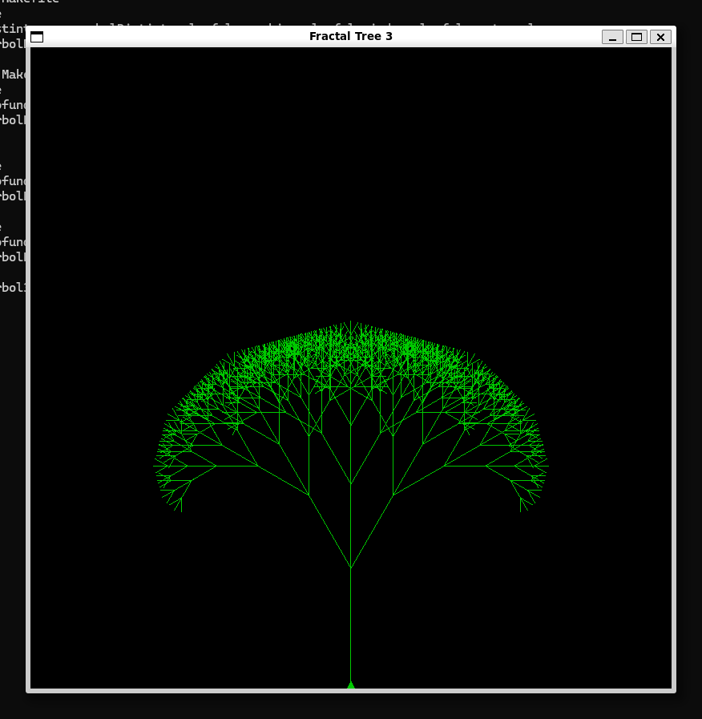
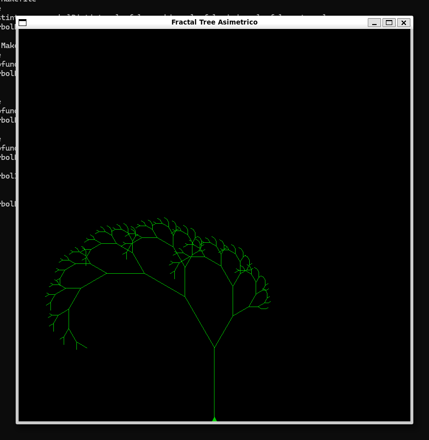
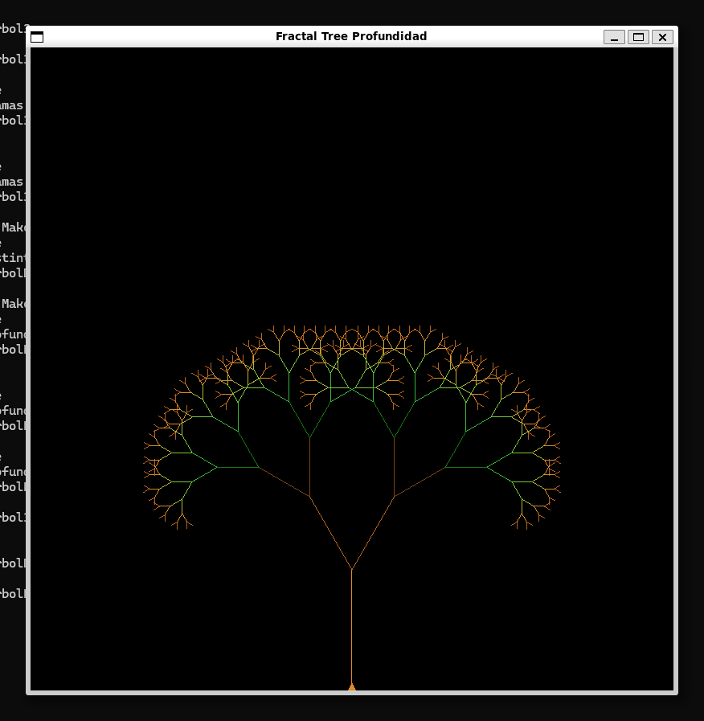
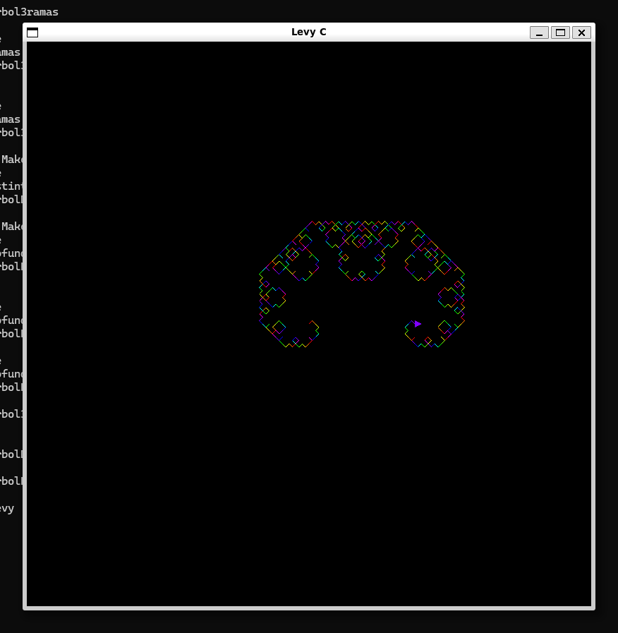

# Laboratorio: Recursividad y Fractales

Práctica de programación en C usando gráficos de tortuga (`turtlec`) para generar fractales y árboles recursivos.

---

## Reto 1 — Árbol de 3 Ramas (`arbol3ramas.c`)

Árbol fractal simétrico donde cada nodo se divide en **tres ramas** del mismo tamaño relativo. Las ramas externas se giran ±30° y la central continúa recta.



| Aspecto | Detalle |
|---|---|
| **Caso base** | `depth == 0` o `length < 5` → retorna sin dibujar |
| **Llamadas recursivas por nivel** | 3 (`fractalTree` se llama tres veces con `length * 0.7f`) |
| **Posición y orientación de la tortuga** | Se avanza con `turtleForward` al inicio del segmento; al terminar las tres ramas se regresa con `turtleBackward` a la posición original. Los giros se balancean: `turtleLeft(30)` antes de la rama izquierda, `turtleRight(30)` para neutralizar y girar a la derecha, `turtleRight(30)` antes de la rama derecha, `turtleLeft(30)` para volver al eje central. |

---

## Reto 2 — Árbol Asimétrico (`arbolDistinto.c`)

Árbol fractal **asimétrico**: la rama izquierda conserva el 80 % de la longitud y la rama derecha solo el 50 %, lo que produce una forma orgánica e irregular.



| Aspecto | Detalle |
|---|---|
| **Caso base** | `depth == 0` o `length < 5` → retorna sin dibujar |
| **Llamadas recursivas por nivel** | 2 (`length * 0.8f` para la izquierda, `length * 0.5f` para la derecha) |
| **Posición y orientación de la tortuga** | Se avanza con `turtleForward` al iniciar. Luego `turtleLeft(30)` para la rama izquierda, `turtleRight(60)` para pasar a la rama derecha, `turtleLeft(30)` para restaurar el ángulo original. Finalmente `turtleBackward` devuelve la tortuga al punto de origen del segmento. |

---

## Reto 3 — Árbol con Color por Profundidad (`arbolProfundidad.c`)

Árbol fractal de 2 ramas donde el color de cada segmento varía según el nivel de profundidad, generando un degradado visual de tonos marrones (raíz/tronco) a verdes (hojas).



| Aspecto | Detalle |
|---|---|
| **Caso base** | `depth == 0` o `length < 5` → retorna sin dibujar |
| **Llamadas recursivas por nivel** | 2 (`fractalTree` se llama dos veces con `length * 0.7f`) |
| **Posición y orientación de la tortuga** | Igual que el reto 2: `turtleForward` al inicio, giros compensados (`Left 30` → `Right 60` → `Left 30`) y `turtleBackward` al final. Se restaura también el color con `colorDepth(turtle, depth)` antes del `turtleBackward` para que el segmento padre mantenga su color correcto. |

**Paleta de colores (`colorDepth`):**

| `depth % 7` | Color |
|---|---|
| 0 | Marrón oscuro `(120, 70, 20)` |
| 1 | Marrón `(180, 100, 30)` |
| 2 | Marrón claro `(220, 140, 40)` |
| 3 | Amarillo verdoso `(180, 180, 60)` |
| 4 | Verde claro `(120, 200, 60)` |
| 5 | Verde medio `(60, 180, 60)` |
| 6 | Verde oscuro `(20, 120, 20)` |

---

## Reto 4 — Curva de Lévy (`levy.c`)

Implementación de la **Curva C de Lévy**: en cada nivel el segmento se reemplaza por dos segmentos de longitud `length / √2` rotados 45°, produciendo una curva fractal con aspecto de espiral cuadrada. El color varía por nivel usando 9 tonos arcoíris.



| Aspecto | Detalle |
|---|---|
| **Caso base** | `depth == 0` → dibuja el segmento con `turtleForward` y retorna |
| **Llamadas recursivas por nivel** | 2 (`levy` se llama dos veces con `length / sqrt(2)` y `depth - 1`) |
| **Posición y orientación de la tortuga** | Antes de la primera llamada: `turtleLeft(45)`. Entre las dos llamadas: `turtleRight(90)`. Después de la segunda llamada: `turtleLeft(45)`. Esto mantiene la orientación neta del segmento (los giros se cancelan: −45 + 90 − 45 = 0°). |

**Paleta de colores (`colorLevel`, 9 casos arcoíris):**

| `level % 9` | Color |
|---|---|
| 0 | Rojo `(255, 0, 0)` |
| 1 | Naranja `(255, 128, 0)` |
| 2 | Amarillo `(255, 255, 0)` |
| 3 | Verde-amarillo `(128, 255, 0)` |
| 4 | Verde `(0, 255, 0)` |
| 5 | Cian `(0, 255, 255)` |
| 6 | Azul `(0, 0, 255)` |
| 7 | Violeta `(127, 0, 255)` |
| 8 | Magenta `(255, 0, 255)` |

---

## Uso de IA

Se utilizó IA (Claude) como apoyo en el desarrollo de los siguientes aspectos:

### Prompt 1 — Gradiente de tronco a hojas en `colorDepth` (Reto 3)

> "tengo `void colorDepth(Turtle *turtle, int depth){ switch(depth % 7){ case 0: turtleSetColor(turtle, 120, 70, 20); break; case 1: turtleSetColor(turtle, 180, 100, 30); break;` necesito hasta el `case 6`" (colores gradientes)

Se usó para completar los 7 casos del `switch` con un degradado que va de **marrón oscuro** (niveles profundos = tronco/ramas gruesas) a **verde oscuro** (niveles altos = hojas), imitando visualmente la transición natural de un árbol.

---

### Prompt 2 — Paleta arcoíris de 9 colores en `colorLevel` (Reto 4)

> "tengo el siguiente caso de colores:
> ```c
> switch(depth % 6){
>     case 0: turtleSetColor(turtle, 255, 0, 0);   break;
>     case 1: turtleSetColor(turtle, 255, 164, 0); break;
>     case 2: turtleSetColor(turtle, 255, 255, 0); break;
>     case 3: turtleSetColor(turtle, 0, 255, 0);   break;
>     case 4: turtleSetColor(turtle, 0, 0, 255);   break;
>     case 5: turtleSetColor(turtle, 127, 0, 127); break;
> }
> ```
> ¿puedes darme para que sean 9 casos? (color arcoíris)"

Se amplió la paleta de 6 a **9 colores arcoíris** añadiendo verde-amarillo, cian y violeta, logrando un recorrido más completo y suave del espectro visible a lo largo de los niveles de la curva de Lévy.

---

### Prompt 3 — Generación de este README

> "a este proyecto, hasle un README.MD para describir los retos propuestos por la practica de 'Recursividad Laboratorio' en este caso los codigos y las capturas son arbol3ramas.c --- reto1; arbolDistinto.c ---- reto2; arbolProfundidad.c ---- reto3; levy.c ---- reto4. la documentacion debe tener comentario sobre cada reto (comentario breve) - cual es el caso base de la funcion recursiva. - cuantas llamadas recursivas realiza la funcion en cada nivel. - que instrucciones permiten que la tortuga mantenga una posicion y orientacion adecuadas. - como uso de IA, incluya los prompts [...]"

---

## Compilación

```bash
make arbol3ramas
make arbolDistinto
make arbolProfundidad
make levy
```

O manualmente:

```bash
gcc examples/arbol3ramas.c turtlec.c -o arbol3ramas -lm -lSDL2
```
